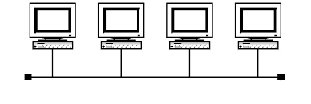
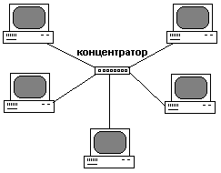
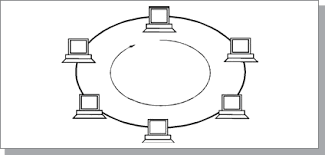
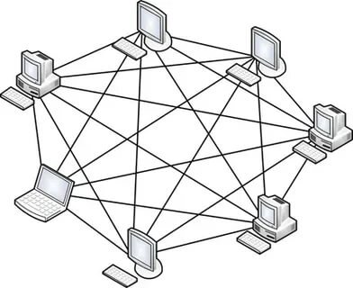
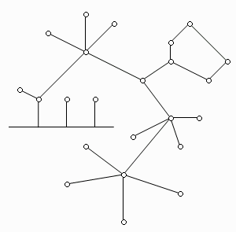

Network topologies are the placement of computers and other devices in communication networks

  Using topology, you can determine how a network is built, how devices interact and data is transferred. A correctly selected and constructed topology allows you to effectively organize the operation of the network and increase its reliability.

  Topology is also divided into physical (the location of computers in space) and logical (how data is transferred between each other)
- Physical organization, for example, includes networks organized in the form of a star, ring, bus or tree structure.
- Logical - forms of client-server or peer-to-peer networks, where all devices have equal communication capabilities.

It is important to note that a network topology can be a combination of different physical and logical topologies

Basic concepts related to this topic

1. Node:

A node is a specific device or computer connected to a network. This can be either a server or a client computer, printer or router.
    1. network branch - a path connecting two adjacent nodes;
    2. terminal node - a node located at the end of only one branch;
    3. intermediate node - a node located at the ends of more than one branch;
    4. adjacent nodes - nodes connected by at least one path that does not contain any other nodes.

2. Connection (Link):

A connection is a physical connection between nodes in a network. This can be a wired or wireless connection.

3. Network Device:

A network device is equipment that enables communication and data transfer between nodes on a network. Examples of such devices: switch, router, bridge, hub and others.

4. Topology:

Topology defines the physical structure and connections between nodes in a network. There are different types of topologies such as star, ring, bus, tree and mixed topology.

5. Data transfer:

Data transmission is the process of exchanging information between nodes in a network. It can be carried out using various protocols, such as TCP/IP, Ethernet and others.

6. Network addresses (IP addresses):

Network addresses are used to identify nodes on a network. They allow you to address and route data between nodes. IP version 4 (IPv4) and IP version 6 (IPv6) addresses are common on the Internet.
Source: https://uchet-jkh.ru/i/setevaya-topologiya-opredelenie-i-struktura

Types of network topologies:

1. General Bus
- In this case, the connection and data exchange is carried out through a common communication channel, called a common bus (Fig. [-@fig:001]).

{#fig:001 width=70%}

  The public bus is a very common topology for local area networks. The transmitted information can be distributed in both directions. The use of a common bus reduces wiring costs and unifies the connection of various modules. 

  The main advantages of this scheme are the low cost and ease of cable distribution throughout the premises. 

  The most serious disadvantage of the common bus is its low reliability: any defect in the cable or any of the numerous connectors completely paralyzes the entire network. Another disadvantage of the shared bus is its low performance, since with this connection method only one computer at a time can transmit data to the network. Therefore, the communication channel bandwidth is always divided here between all network nodes.

2. Star
- In this case, each computer is connected by a separate cable to a common device called a hub, which is located in the center of the network (Fig. [-@fig:002]).

{#fig:002 width=70%}

  The function of a hub is to direct information transmitted by a computer to one or all other computers on the network. 

  The main advantage of this topology over a common bus is significantly greater reliability. Any problems with the cable affect only the computer to which this cable is connected, and only a malfunction of the hub can bring down the entire network. In addition, the hub can play the role of an intelligent filter of information coming from nodes on the network and, if necessary, block transmissions prohibited by the administrator.

  The disadvantages of a star topology include the higher cost of network equipment due to the need to purchase a hub. In addition, the ability to increase the number of nodes in the network is limited by the number of hub ports. Currently, a hierarchical star is the most common type of connection topology in both local and global networks.

3. Ring
- In networks with a ring topology, data in the network is transmitted sequentially from one station to another along the ring, usually in one direction (Fig. [-@fig:003]).

{#fig:003 width=70%}

  If the computer recognizes the data as intended for it, then it copies it to its internal buffer. In a network with a ring topology, it is necessary to take special measures so that in the event of an outage Troubleshooting or shutdown of any station did not interrupt the communication channel between other stations. The advantage of this topology is ease of management, the disadvantage is the possibility of failure of the entire network if there is a failure in the channel between two nodes.

4. Mesh topology (or partial mesh, where each node is connected to each other)
- The mesh topology is characterized by a computer connection scheme in which physical communication lines are established with all adjacent computers (Fig. [-@fig:004]).

{#fig:004 width=70%}

  In a network with a mesh topology, only those computers between which intensive data exchange occurs are directly connected, and for data exchange between computers that are not directly connected, transit transmissions through intermediate nodes are used. The mesh topology allows the connection of a large number of computers and is typically characteristic of global networks. 
 
  The advantages of this topology are its resistance to failures and overloads, because There are several ways to bypass individual nodes.

5. Mixed topology
- While small networks, as a rule, have a standard topology, large networks are characterized by the presence of arbitrary connections between computers. In such networks, individual subnetworks with a typical topology can be arbitrarily distinguished, which is why they are called networks with mixed topology (Fig. [-@fig:004]).

{#fig:005 width=70%}

In addition, there are several other network topologies, for example, a tree.
This type of topology is most often used when installing local networks with a small number of devices, mainly when creating corporate switches. Combines fairly low cost and very good performance. Especially when combining different transmission lines - a combination of copper and fiber cabling systems, and the use of managed switches.

