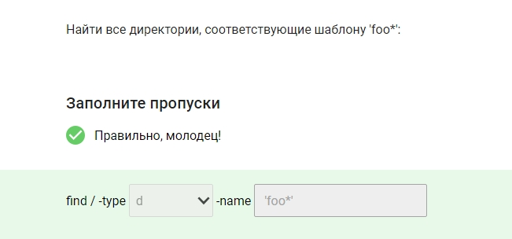
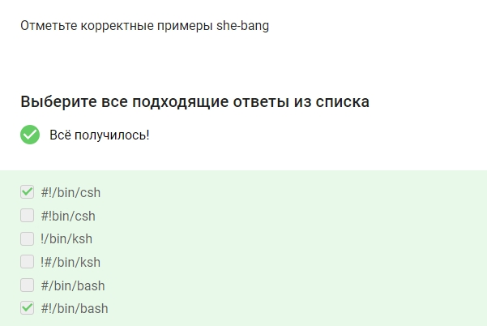
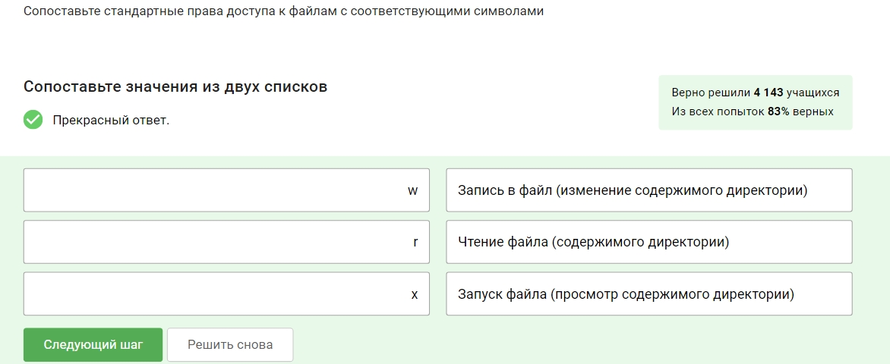

# Цель работы

Прохождение курса "Основы Linux" на платформе Stepik

# Выполнение 

Здесь и далее представлены скриншоты, подтверждающие прохождение курса и демонстрирующие выполнение контрольных заданий

- Чтобы узнать справку по команде, ознакомиться с принципами ее работы надо ввести man и название команды(рис. 001 ).

 001

- Для получения справки по команде ls надо ввести man ls
(рис. 002 ).

 002

- Введя pwd, пользователь получает путь до своего местоположения в каталогах(рис. 003 ).

 003

- Символ / нужен для обозначения начала пути файловой системы(рис. 004 ).

 004

- С помощью утилиты ls можно посмотреть список всего содержимого директории. Другие варианты этим функционалом не обладают(рис. 005 ).

 005

- Параметр -а позволяет увидеть всю информацию, даже скрытых файлов(рис. 006 ).

 006

- Ключ -а позволяет увидеть всю информацию, даже скрытых файлов(рис. 007 ).

 007

- Ключ  -р или же parent позволяет создавать сразу вложенные директории(рис. 008 ).

 008

- Находясь внутри директории, чтобы она создалась раньше необходимо прописать чуть более подробный путь, также используя ключ р(рис. 009 ).

 009

- Утилита file используется для определения типа файлов. Остальные команды нужны для удаления и создания файлов, просмотра содержимого (рис. 010 ).

 010
 
- Утилита touch создает пустой файл, отсальные уоманды этим функционалом не обладают(рис. 011 ).

 011

- Команда rm удаляет файлы навсегда, восстановить их невозможно(рис. 012 ).

 012

- В данной ОС имена файлов зависят от регистра - файлы с маленькой и с большой буквы разные(рис. 013 ).

 013

- Ключ -r recursive необходим для выполнения копирования рекурсивно(рис. 014 ).

 014

- Для полного удаления используем rf - recirsive and force(рис. 015 ).

 015

- Вывести начальные строки позволяет комадна head. Это возможно сделать и по-другому, но с уточнениями(рис. 016 ).

 016

- Вывести конечные строки позволяет комадна head. Это возможно сделать и по-другому, но с более подробным синтаксисом(рис. 017 ).

 017

- Просматривать файлы, разделив их на страницы, можно командами more и less(рис. 018 ).

 018

- Вывод последних 2х строк возможен командой tail с ключом -2 и названием файла(рис. 019 ).

 019

- Для хранения своих персональных данных существует директория home(рис. 020 ).

 020

- Имена скрытых файлов всегда начинаются именно с символа точки(рис. 021 ).

 021  

- Для съемных устройств точкой монтирования является директория media(рис. 022 ).

- Файлы конфигурации хранятся в etc(рис. 023 ).

 023

- В свою очередь файлы устройства находятся в dev - device(рис. 024 ).

 024

- Центральное хранилище журналов - var/log(рис. 025 ).

 025  

- Из представленных вариантов кэшированные данные приложений могут содержаться в var/cache(рис. 026 ).

 026  

- Данная команда передает 4 аргумента -  4 пары одинарных кавычек(рис. 027 ).

 027  

- Количество пробелов сохраниться только если передавать всю строку целиком, с помощью одинарных или двойных кавычек(рис. 028 ).

 028  

- Определить данное различие команд можно с помощью type(рис. 029 ).

 029  

- Для такого типа поиска используется команда which(рис. 030 ).

 030  

- Чтобы создать псевдоним используем alias и соответственно название и команду(рис. 031 ).

 031  

- Из перечисленных команд встроеннымиявляются - alias, echo. Остальные к ним не относятся(рис. 032 ).

 032  

- Внешними являются все представленные команды кроме alias. Обратим внимание, что команда может одновременно относиться к обоим типам(рис. 033 ).

 033  

- Рассмотрим соотношение бинарных файлов и директорий
alias - 

route - sbin

rm - bin

tac - usr/bin
(рис. 034 ).

 034  

- Для последовательного выполнения команд, заданых одной строкой использюется знак ;(рис. 035 ).

 035  

- При остутсствие необходимости ожидания заврешения работы  можно использовать &  и сразу ввводить новую команду(рис. 036 ).

 036  

- Логическое и - &&

Логическо или - ||(рис. 037 ).

 037  

- '#' - символ для последующего написания комментариев(рис. 038 ).

 038  

- При необходимости вывод символа без его свойств используется обратный слэш - \(рис. 039 ).

 039  

- Узнать текущее местоположение и содержимое кталога можно введя  pwd; ls(рис. 040 ).

 040  

- Данная строка удаляет файл и сообщает, успешно или нет выполнена команда(рис. 041 ).

 041  

- Переменные в оболочке обозначаются символом доллара $(рис. 042 ).

 042  

- Присвоение значения происходит так: $Имя=Значение. Обратим внимание, на отсутствие пробелов(рис. 043 ).

 043  

- Список переменных можно увидеть с помощью команд set и env(рис. 044 ).

 044  

- В выводе название переменной указано в кавычках, следовательно результатом будет просто название, а не значение(рис. 045 ).

 045  

- Здесь используются двойные кавычки, что дает компьютеру понять, что вывести надо значение переменной(рис. 046 ).

 046  

- Для удаления переменной окружения использутеся unset(рис. 047 ).

 047  

- Это делает переменная $PATH(рис. 048 ).

 048  

Данное действие  можно осуществить с помощью доллара и скобок или же одинарных кавычек(рис. 049 ).

 049  

- Многоуровневое встраивание делается за счет символа доллара и кавычек(рис. 050 ).

 050  

- На скриншоте видно правильное соотношение(рис. 051 ).

 051  

- Пробел позволяет не сохранять команду в истории(рис. 052 ).

 052  

- Сохранить определнное количество команд в истории возможно указав размер командой HISTSIZE(рис. 053 ).

 053  

- Соотношение потоков ввода-вывода и номеров представлено ниже(рис. 054 ).

 054  

- Содержимое будет удалено при использовании > (рис. 055 ).

 055  

- Сообщение не будет выводиться при перенаправлении потоков - в 1м и последнем случаях(рис. 056 ).

 056  

- Активирование режима происходит командами set -o noclobber и  set -C(рис. 057 ).

 057  

- Да, параметр активирован, перезапись предотвращается(рис. 058 ).

 058  

- Два вывода имеется только у командаы tee(рис. 059 ).

 059  

- Команды и их функционал представлены на скриншоте (рис. 060 ).

 060  

- В пропуск, для подсчета строк, необходимо добавть wc(рис. 061 ).

 061  

- Для сортировки по второму столбцу используем ключ -k 2(рис. 062 ).

 062  

- На скриншоте показано праавильное соотношение команд и того, для чего и когда они применяются(рис. 063 ).

 063  

- Для того, чтобы созданный файл можно было найти с помощью locate необходимо обновить базу данных - updatedb(рис. 064 ).

 064  

- Найти все директории можно ключом -d. Также необходимо указать сам шаблон для поиска - "foo" (рис. 065 ).

 065  

- Поиск файлов рсуществялется с помощью указания f  и шаблона '*bar'(рис. 066 ).

 066  

- Для поиска и копирования файлов введем катаолг /etc, шаблон файлов и пропишем копирование(рис. 067 ).

 067  

- На скриншоте представлено соответсвие сокращений с их расшифровками(рис. 068 ).

 068  

- При таком выводе могли использоваться только 2 и 6 команды с ключом G и E и таким синтаксисом(рис. 069 ).

 069  

- Из Бельгии найти спортсменов можно используя ключ -i, то есть не учитывая регистр(рис. 070 ).

 070  

- Правильное соотношение маски с выводом представлено ниже(рис. 071 ).

 071  

- Данный вывод возможен только при вводе команд 2 и 6 - обязательно не учитывается регистр и соответсвующий синтаксис(рис. 072 ).

 072  

- Здесь  происходит замена "За" на "При", получается Приморский(рис. 073 ).

 073  

- В следующем примере заменилось "Заморский" на "Заморить", следовательно заменили "ский" на "ить"(рис. 074 ).

 074  

- В этом случае символы && дублирует текст перед этим - получается послепослезавтра (рис. 075 ).

 075  

- Здесь происходит перестановка числа и месяца, также меняется символточки на слэш(рис. 076 ).

 076  

- Клавиша esc предназначена для перевода редактора в режим ввода команд, а вот для ввода текста используется insert(рис. 077 ).

 077  

- Перейти в режим ввода текста можно командами a, i, o(рис. 078 ).

 078  

- w - write, сохранение, q - quit, завершение, также это можно сделать командой ZZ (рис. 079 ).

 079  

- Соотношение команд и их функцинала представлено на скриншоте(рис. 080 ).

 080  

- yyp - комбинация для создания дупликата строки(рис. 081 ).

 081  

- Для смены строк местами необходимо использовать сочетание ddp(рис. 082 ).

 082  

- Для выполнения этого действия надо сначала указать номера строк, затем где меняем и на что меняем(рис. 083 ).

 083  

- she-bang - последовательность символом для запуска сценариев в оболочке(рис. 084 ).

 084  

- Примеры she-bang должны включать в себя #! bin и оболочку - bash, csh и другие(рис. 085 ).

 085  

- Для запуска в оболочке Korn shell необходимо написать ее сокращение - ksh(рис. 086 ).

 086  

- На скриншоте прдеставлен написанный пример программы, читающей и выводящей различные переменные(рис. 087 ).

 087  

- Команде test эквивалентны символы [] (рис. 088 ).

 088  

- На скриншоте представлено верное соотношение синтаксиса команды с тем, что она делает(рис. 089 ).

 089  

- Проанализировав представленный код, можно понять, что выводиться будет "мало" , так как выполнятеся условия else(11 меньше 42)(рис. 090 ).

 090  

- При исполнении скрипта выводится 1: 4 - 3, так как выполняется первое условие(рис. 091 ).

 091  

- Для последовательного вывода чисел необходимо просто прописать условие - 10..1(рис. 092 ).

 092  

- Здесь также необходимо только прописать условие "пока i меньше или равно 11"(рис. 093 ).

 093  

- Аналогично прописываем условия соотаетсвенно заданию - "пока не станет меньше 3"(рис. 094 ).

 094  

- Напишем скрипт, считывающий переменные и выводяший сумму от a до  b(рис. 095 ).

 095  

- На скриншоте представлено соотношение символа $ и доп символов с их обозначениями - номерами аргументов, их количеством и тд(рис. 096 ).

 096  

- Для получения параметров сценариев существует специальная функция  getopts(рис. 097 ).

 097  

- В свою очередь параметры функционирования оболочки можно получить с  помощью shopt(рис. 098 ).

 098  

- Последовательный вывод аргументов с предварительной проверкой аргументов осуществляется циклом while  и передачей туда аргументов(рис. 099 ).

 099  

- Команда eval - evaluate позволяет интерпретировать аргументы в директивы сценария оболочки(рис. 100 ).

 100  

- Наличие двойных скобок позволяет сравнивать числовые значения(рис. 101 ).
 
 101  

- Вычисления значений в оболочке происходят командой let(рис. 102 ).

 102  

- За имя учетной записи отвечает команда who am i(whoami), другие вариации невозможны(рис. 103 ).

 103  

- Входящих в системы, напротив, можно узнать командами who и w(рис. 104 ).

 104  

- id - утилита для подробной информации об идентификаторе, группах и тд пользователя(рис. 105 ).

 105  

- Запуск оболочки от лица суперпользователя осуществялется командой su (рис. 106 ).

 106  

- Команда по умолчанию не меняет переменные окружения оболочки(рис. 107 ).

 107  

- Команда su - позволяет работать в окружении оболочки целевого пользователя, а не обязательно исходного, как по умолчанию(рис. 108 ).

 108  

- Не зная пароля, но введя команду sudo, можно выполнить команду от имени другого пользователя(рис. 109 ).

 109  

- По умолчанию пароль от root не задается, это можно сделать самостоятельно в настройках(рис. 110 ).

 110  

- Вся локальная база даннных учетных записей нахоится в директории   passwd(рис. 111 ).

 111  

- Больше всего полномочий иммет пользователь root или же суперпользователь(рис. 112 ).

 112  

- На скриншоте представлено верное соотношения утилит и функций(рис. 113 ).

 113  

- Директория skel - директория-шаблон домашней директории(рис. 114 ).

 114  

- Именно в зашифрованном виде пароли хранятся в каталогу shadow(рис. 115 ).

 115  

- Утилиты openssl и passwd позволяют шифровать фразу для создания пароля, друние утилиты для этого не подходят(рис. 116 ).

 116  

- Данная утилита обладает большим функционалом, в частности она позволяет устанавливать различные даты и сроки действия паролей(рис. 117 ).

 117  

- Наличие ! перед кэшем свидельствует о блокировке записи (рис. 118 ).

 118  

- Необходим файл, находящийся в каталоге etc(рис. 119 ).

 119  

- В целом, подходят все представленные варианты(рис. 120 ).

 120  

- Название утилиты gropadd указывает на то, что она создает новую группу(рис. 121 ).

 121  

- Принадлежность пользователей к группам содержится в папке group(рис. 122 ).

 122  

- Groups - команда, показывающая принадлежность пользователя к группам(рис. 123 ).

 123  

- Usermod - команда, позволящая изменить членство пользователя. Остальные команды были рассмотрены ранее(groupmod - изменение имени)(рис. 124 ).

 124  

- Для этого существует ключ а(рис. 125 ).

 125  

- Groupmod - утилита для изменения названия, аналогична usermod(рис. 126 ).

 126  

- А вот утилита chown позволяет менять и имя группы, и пользователя владеющими файлом(рис. 127 ).

 127  

- Chgrp - изменение имени группы, владеющей файлом(рис. 128 ).

 128  

- Утилита chmod  отвечает за права доступа к файлу(не путать с chown(рис. 129 ).

 129  

- Заменить имя пользователя позволит команда chown с указанием на кого менять и каталога(рис. 130 ).

 130  

- Для замены группы воспользуемся командой chgrp, остальное аналогичнопримеру выше(рис. 131 ).

 131  

- Для замены и группы и владельца необходима команда chown и запись через двоеточие(рис. 132 ).

 132  

- Соответсвие обозначений и расшифровки представлено ниже(рис. 133 ).

 133  

- Ниже представлено сопоставление прав доступа и их сокращений(рис. 134 ).

 134  

- Для каждого пользователя отведено по ___, соответственно владельцу доступны вход и чтение, остальным только доступ(рис. 135 ).

 135  

- Основываясь на команде, можно понять, что у владельца есть право на все, его группа имеет право на чтение и исполнение, у остальных пользователей только чтение, также, по дальнейшей информации, видно, что это файл(рис. 136 ).

 136  

- Основываясь на таблице соответствий легко перевести права в виде строки в численное значение - 755(рис. 137 ).

 137  

- (рис. 138 ).

 138  

- Аналогично получим 740((рис. 139 ).

 139  

- Переведем в двоичную систему - пропуск=ноль, буква=1(рис. 140 ).

 140  

- Функция sticky заключается в предотвращении удаления файлов пользователей не владельцев(рис. 141 ).

 141  

- Описание использование бита описано в последнем варианте(рис. 142 ).

 142  

- Описание использование бита описано во втором варианте - используется для повышения прав(рис. 143 ).

 143  

- Утилита getfacl позволяет читать списки контроля доступа, а вот модификации и запись осуществить не получится(рис. 144 ).

 144  

- Зато следующая утилита как ра-таки позволяет выполнить все эти операции - запись, удаление и модификация(рис. 145 ).

 145  

- Inode - сьруктура данных, содержащая метаданные файла(рис. 146 ).

 146  

- ls -li  - команда для просмотра идентификаторов структуры(рис. 147 ).

 147  

- Жесткие ссылки ограничены своими разделами дисков, имеют те же права, что и файл и связаны с inode. Права доступа имеют значение,они также указывают на структуры inode и не могут указывать на файлы из других систем (рис. 148 ).

 148  

- Симвоилческие ссылки противоположны жестким по своей сути(рис. 149 ).

 149  

- Ниже представлено соотношение файлов в каталогах с их содержимым(рис. 150 ).

 150  

- Ниже представлено верное соотношение утилит с их значением(рис. 151 ).

 151  

Завершение курса

К сожалению, в процессе выполнения курса пришлось столкнуться с проблемой невозможности получения баллов за некоторые задания в связи с настройками авторов, тем не менее пройдено 92% материала и выполнены все задания.

(рис. 152 ).

 152  

# Выводы

В отчете представлено прохождение курса "Основы Linux" на платформе Stepik. В ходе работы былы получены знания по работе с операционной системой, изучены различные тонкости и нюансы, написано несколько скриптов и выполнено определенное количество заданий

