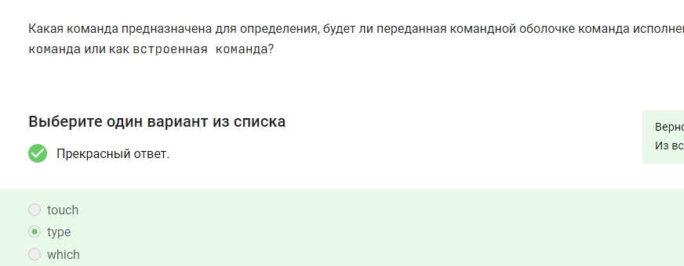
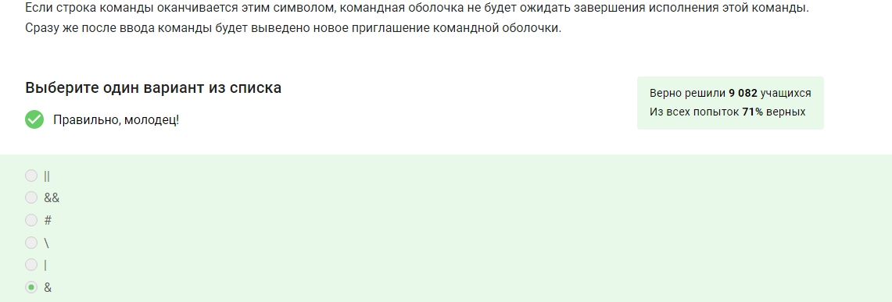
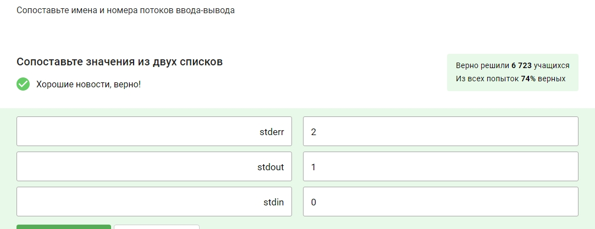
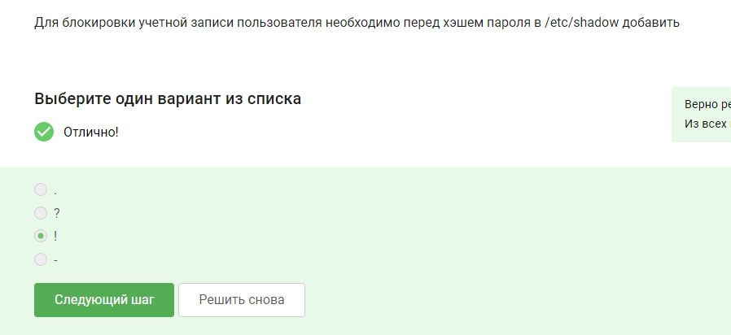
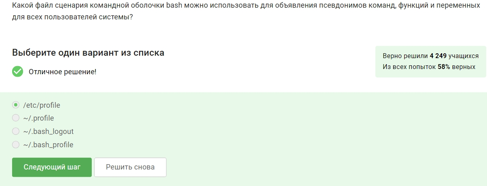
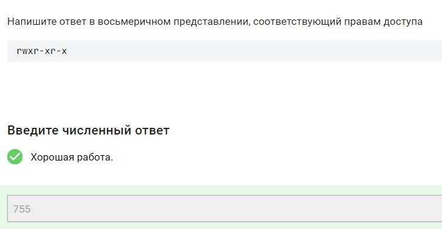
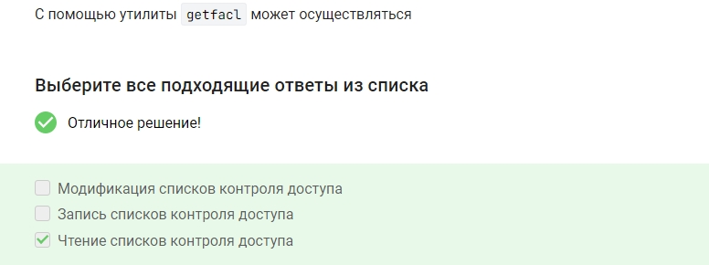

# Цель работы

Прохождение курса "Основы Linux" на платформе Stepik

# Выполнение 

Здесь и далее представлены скриншоты, подтверждающие прохождение курса и демонстрирующие выполнение контрольных заданий

Чтобы узнать справку по команде, ознакомиться с принципами ее работы надо ввести man и название команды(рис. [-@fig:001]).

Для получения справки по командк ls надо ввести man ls
(рис. [-@fig:002]).

Введя pwd, пользователь получает путь до своего местоположения в каталогах(рис. [-@fig:003]).

Символ / нужен для обозначения начала пути файловой системы(рис. [-@fig:004]).

{#fig:004 width=70%}

С помощью утилиты ls можно посмотреть списко всего содержимого директории. Другие варианты этим функцмоналом не обладают(рис. [-@fig:005]).

{#fig:005 width=70%}

Параметр -а позволяет увидеть всю информацию, даже скрытых файлов(рис. [-@fig:006]).

{#fig:006 width=70%}

Ключ -а позволяет увидеть всю информацию, даже скрытых файлов(рис. [-@fig:007]).

{#fig:007 width=70%}

Ключ  -р или же parent позволяет создавать сразу вложенные директории(рис. [-@fig:008]).

{#fig:008 width=70%}

Находясь внутри директории, чтобы она создалась раньше необходимо прописать чуть более подробный путь, также используя ключ р(рис. [-@fig:009]).

{#fig:009 width=70%}

Утилита file используется для определения типа файлов. Остальные команды нужны для удаления и создания файлов, просмотра содержимого (рис. [-@fig:010]).

{#fig:010 width=70%}

Утилита touch создает пустой файл, отсальные уоманды этим функционалом не обладают(рис. [-@fig:011]).

{#fig:011 width=70%}

Команда rm удаляет файлы навсегда, восстановить их невозможно(рис. [-@fig:012]).

{#fig:012 width=70%}

В данной ОС имена файлов зависят от регистра - файлы с маленькой и с большой буквы разные(рис. [-@fig:013]).

{#fig:013 width=70%}

Ключ -r recursive необходим для выполнения копирования рекурсивно(рис. [-@fig:014]).

{#fig:014 width=70%}

Для полного удаления используем rf - recirsive and force(рис. [-@fig:015]).

{#fig:015 width=70%}

Вывести начальные строки позволяет комадна head. Это возможно сделать и по-другому, но с уточнениями(рис. [-@fig:016]).

{#fig:016 width=70%}

Вывести конечные строки позволяет комадна head. Это возможно сделать и по-другому, но с более подробным синтаксисом(рис. [-@fig:017]).

{#fig:017 width=70%}

Просматривать файлы, разделив их на страницы, можно командами more и less(рис. [-@fig:018]).

{#fig:018 width=70%}

Вывод последних 2х строк возможен командой tail с ключом -2 и названием файла(рис. [-@fig:019]).

{#fig:019 width=70%}

Для хранения своих персональных данных существует директория home(рис. [-@fig:020]).

{#fig:020 width=70%}

Имена скрытых файлов всегда начинаются именно с символа точки(рис. [-@fig:021]).

{#fig:021 width=70%}

Для съемных устройств точкой монтирования является директория media(рис. [-@fig:022]).

{#fig:022 width=70%}

Файлы конфигурации хранятся в etc(рис. [-@fig:023]).

{#fig:023 width=70%}

В свою очередь файлы устройства находятся в dev - device(рис. [-@fig:024]).

{#fig:024 width=70%}

Центральное хранилище журналов - var/log(рис. [-@fig:025]).

{#fig:025 width=70%}

Из представленных вариантов кэшированные данные приложений могут содержаться в var/cache(рис. [-@fig:026]).

{#fig:026 width=70%}

Данна якоманда передает 4 аргумента -  4 пары одинарных кавычек(рис. [-@fig:027]).

{#fig:027 width=70%}

Количество пробелов сохраниться только если передавать всю строку целиком, с помощью одинарных или двойных кавычек(рис. [-@fig:028]).

{#fig:028 width=70%}

Определить данное различие команд можно с помощью type(рис. [-@fig:029]).

{#fig:029 width=70%}

Для такого типа поиска используется команда which(рис. [-@fig:030]).

{#fig:030 width=70%}

Чтобы создать псевдоним используем alias и соответсвенно название и команду(рис. [-@fig:031]).

{#fig:031 width=70%}

Из перечисленных команд встроеннымиявляются - alias, echo. Остальные к ним не относятся(рис. [-@fig:032]).

{#fig:032 width=70%}

Внешними являются все представленные команды кроме alias. Обратим внимание, что команда может одновременно относиться к обоим типам(рис. [-@fig:033]).

{#fig:033 width=70%}

Рассмотримсоотношение бинарных файлов и директирий
alias - 

route - sbin

rm - bin

tac - usr/bin
(рис. [-@fig:034]).

{#fig:034 width=70%}

Для последовательного выполнения команд, заданных одной строкой использюется знак ;(рис. [-@fig:035]).

{#fig:035 width=70%}

При остутсствие необходимости ожидания заврешения работы  можно использовать &  и сразу ввводить новую команду(рис. [-@fig:036]).

{#fig:036 width=70%}

Логическо и - &&

Логическо или - ||(рис. [-@fig:037]).

{#fig:037 width=70%}

'#' - символ для последующего написания комментариев(рис. [-@fig:038]).

{#fig:038 width=70%}

При необходимости вывод символа без его свойств используется обратный слэш - \(рис. [-@fig:039]).

{#fig:039 width=70%}

Узнать текущее местоположение и содержимое кталога можно введя  pwd; ls(рис. [-@fig:040]).

{#fig:040 width=70%}

Данная строка удаляет файл и сообщает, успешно или нет выполнена команда(рис. [-@fig:041]).

{#fig:041 width=70%}

Переменные в оболочке обозначаются символом доллара $(рис. [-@fig:042]).

{#fig:042 width=70%}

Присвоение значения происходит так: $Имя=Значение. Обратим внимание, на отсутствие пробелов(рис. [-@fig:043]).

{#fig:043 width=70%}

Список переменных можно увидеть с помощью команд set и env(рис. [-@fig:044]).

{#fig:044 width=70%}

В выводе название переменной указано в кавычках, следовательно результатом будет просто название, а не значение(рис. [-@fig:045]).

{#fig:045 width=70%}

Здесь используются двойные кавычки, что дает компьютеру понять, что вывести надо значение переменной(рис. [-@fig:046]).

{#fig:046 width=70%}

Для удаления переменной окружения использутеся unset(рис. [-@fig:047]).

{#fig:047 width=70%}

Это делает переменная $PATH(рис. [-@fig:048]).

{#fig:048 width=70%}

Данное действие осуществить с помощью доллара и скобок или же одинарных кавычек(рис. [-@fig:049]).

{#fig:049 width=70%}

Многоуровневое встраиване делается за счет символа доллара и кавычек(рис. [-@fig:050]).

{#fig:050 width=70%}

На скриншоте видно правильное соотношеие(рис. [-@fig:051]).

{#fig:051 width=70%}

Пробел позволяет не сохранять команду в истории(рис. [-@fig:052]).

{#fig:052 width=70%}

Сохранить определнное количество команд в истории возможно указав размер командой HISTSIZE(рис. [-@fig:053]).

{#fig:053 width=70%}

Соотношение потоков ввода-вывода и номеров представлено ниже(рис. [-@fig:054]).

{#fig:054 width=70%}

Содержимое будет удалено при использовании > (рис. [-@fig:055]).

{#fig:055 width=70%}

Сообщение не будет выводиться при перенаправлении потоков - в 1м и последнем случаях(рис. [-@fig:056]).

{#fig:056 width=70%}

Активирование режима происходит командами set -o noclobber и  set -C(рис. [-@fig:057]).

{#fig:057 width=70%}

Да, параметр активирован, перезапись предотвращается(рис. [-@fig:058]).

{#fig:058 width=70%}

Два вывода имеется только у командаы tee(рис. [-@fig:059]).

{#fig:059 width=70%}

Команды и их функционал представлены на скриншоте (рис. [-@fig:060]).

{#fig:060 width=70%}

В пропуск, для подсчета строк, необходимо добавть wc(рис. [-@fig:061]).

{#fig:061 width=70%}

Для сортировки по второму столбцу используем ключ -k 2(рис. [-@fig:062]).

{#fig:062 width=70%}

На скриншоте показано праавильное соотношение команд и того, для чего и когда они применяются(рис. [-@fig:063]).

{#fig:063 width=70%}

Для того, чтобы созданный файл можно было найти с помощью locate необходимо обновить базу данных - updatedb(рис. [-@fig:064]).

{#fig:064 width=70%}

Найти все директории можно ключом -d. Также необходимо указать сам шаблон для поиска - "foo" (рис. [-@fig:065]).

{#fig:065 width=70%}

Поиск файлов рсуществялется с помощью указания f  и шаблона '*bar'(рис. [-@fig:066]).

{#fig:066 width=70%}

Для поиска и копирования файлов введем катаолг /etc, шаблон файлов и пропишем копирование(рис. [-@fig:067]).

{#fig:067 width=70%}

На скриншоте представлено соответсвие сокращений с их расшифровками(рис. [-@fig:068]).

{#fig:068 width=70%}

При таком выводе могли использоваться только 2 и 6 команды с ключом G и E и таким синтаксисом(рис. [-@fig:069]).

{#fig:069 width=70%}

Из Бельгии найти спортсменов можно используя ключ -i, то есть не учитывая регистр(рис. [-@fig:070]).

{#fig:070 width=70%}

Правильное соотношение маски с выводом представлено ниже(рис. [-@fig:071]).

{#fig:071 width=70%}

Данный вывод возможен только при вводе команд 2 и 6 - обязательно не учитывается регистр и соответсвующий синтаксис(рис. [-@fig:072]).

{#fig:072 width=70%}

Здесь  происходит замена "За" на "При", получается Приморский(рис. [-@fig:073]).

{#fig:073 width=70%}

В следующем примере заменилось "Заморский" на "Заморить", следовательно заменили "ский" на "ить"(рис. [-@fig:074]).

{#fig:074 width=70%}

В этом случае символы && дублирует текст перед этим - получается послепослезавтра (рис. [-@fig:075]).

{#fig:075 width=70%}

Здесь происходит перестановка числа и месяца, также меняется символточки на слэш(рис. [-@fig:076]).

{#fig:076 width=70%}

Клавиша esc предназначена для перевода редактора в режим ввода команд, а вот для ввода текста используется insert(рис. [-@fig:077]).

{#fig:077 width=70%}

Перейти в режим ввода текста можно командами a, i, o(рис. [-@fig:078]).

{#fig:078 width=70%}

w - write, сохранение, q - quit, завершение, также это можно сделать командой ZZ (рис. [-@fig:079]).

{#fig:079 width=70%}

Соотношение команд и их функцинала представлено на скриншоте(рис. [-@fig:080]).

{#fig:080 width=70%}

yyp - комбинация для создания дупликата строки(рис. [-@fig:081]).

{#fig:081 width=70%}

Для смены строк местами необходимо использовать сочетание ddp(рис. [-@fig:082]).

{#fig:082 width=70%}

Для выполнения этого действия надо сначала указать номера строк, затем где меняем и на что меняем(рис. [-@fig:083]).

{#fig:083 width=70%}

she-bang - последовательность символом для запуска сценариев в оболочке(рис. [-@fig:084]).

{#fig:084 width=70%}

Примеры she-bang должны включать в себя #! bin и оболочку - bash, csh и другие(рис. [-@fig:085]).

{#fig:085 width=70%}

Для запуска в оболочке Korn shell необходимо написать ее сокращение - ksh(рис. [-@fig:086]).

{#fig:086 width=70%}

На скриншоте прдеставлен написанный пример программы, читающей и выводящей различные переменные(рис. [-@fig:087]).

{#fig:087 width=70%}

Команде test эквивалентны символы [] (рис. [-@fig:088]).

{#fig:088 width=70%}

На скриншоте представлено верное соотношение синтаксиса команды с тем, что она делает(рис. [-@fig:089]).

{#fig:089 width=70%}

Проанализировав представленный код, можно понять, что выводиться будет "мало" , так как выполнятеся условия else(11 меньше 42)(рис. [-@fig:090]).

{#fig:090 width=70%}

При исполнении скрипта выводится 1: 4 - 3, так как выполняется первое условие(рис. [-@fig:091]).

{#fig:091 width=70%}

Для последовательного вывода чисел необходимо просто прописать условие - 10..1(рис. [-@fig:092]).

{#fig:092 width=70%}

Здесь также необходимо только прописать условие "пока i меньше или равно 11"(рис. [-@fig:093]).

{#fig:093 width=70%}

Аналогично прописываем условия соотаетсвенно заданию - "пока не станет меньше 3"(рис. [-@fig:094]).

{#fig:094 width=70%}

Напишем скрипт, считывающий переменные и выводяший сумму от a до  b(рис. [-@fig:095]).

{#fig:095 width=70%}

На скриншоте представлено соотношение символа $ и доп символов с их обозначениями - номерами аргументов, их количеством и тд(рис. [-@fig:096]).

{#fig:096 width=70%}

Для получения параметром сценариев существует спциальная функция  getopts(рис. [-@fig:097]).

{#fig:097 width=70%}

В свою очередь параметры функционирования оболочки можно получить с  помощью shopt(рис. [-@fig:098]).

{#fig:098 width=70%}

Последовательный вывод аргументов с предварительной проверкой аргументов осуществляется циклом while  и передачей туда аргументов(рис. [-@fig:099]).

{#fig:099 width=70%}

Команда eval - evaluate позволяет интерпретировать аргументы в директивы сценария оболочки(рис. [-@fig:100]).

{#fig:100 width=70%}

Наличие двойных скобок позволяет сравнивать числовые значения(рис. [-@fig:101]).
 
{#fig:101 width=70%}

Вычисления значений в оболочке происходят командой let(рис. [-@fig:102]).

{#fig:102 width=70%}

За имя учетной записи отвечает команда who am i(whoami), другие вариации невозможны(рис. [-@fig:103]).

{#fig:103 width=70%}

Входящих в системы, напротив, можно узнать командами who и w(рис. [-@fig:104]).

{#fig:104 width=70%}

id - утилита для подробной информации об идентификаторе, группах и тд пользователя(рис. [-@fig:105]).

{#fig:105 width=70%}

Запуск оболочки от лица суперпользователя осуществялется командой su (рис. [-@fig:106]).

{#fig:106 width=70%}

Команда по умолчанию не меняет переменные окружения оболочки(рис. [-@fig:107]).

{#fig:107 width=70%}

Команда su - позволяет работать в окружении оболочки целевого пользователя, а не обязательно исходного, как по умолчанию(рис. [-@fig:108]).

{#fig:108 width=70%}

Не зная пароля, но введя команду sudo, можно выполнить команду от имени другого пользователя(рис. [-@fig:109]).

{#fig:109 width=70%}

По умолчанию пароль от root не задается, это можно сделать самостоятельно в настройках(рис. [-@fig:110]).

{#fig:110 width=70%}

Вся локальная база даннных учетных записей нахоится в директории   passwd(рис. [-@fig:111]).

{#fig:111 width=70%}

Больше всего полномочий иммет пользователь root или же суперпользователь(рис. [-@fig:112]).

{#fig:112 width=70%}

На скриншоте представлено верное соотношения утилит и функций(рис. [-@fig:113]).

{#fig:113 width=70%}

Директория skel - директория-шаблон домашней директории(рис. [-@fig:114]).

{#fig:114 width=70%}

Именно в зашифрованном виде пароли хранятся в каталогу shadow(рис. [-@fig:115]).

{#fig:115 width=70%}

Утилиты openssl и passwd позволяют шифровать фразу для создания пароля, друние утилиты для этого не подходят(рис. [-@fig:116]).

{#fig:116 width=70%}

Данная утилита обладает большим функционалом, в частности она позволяет устанавливать различные даты и сроки действия паролей(рис. [-@fig:117]).

{#fig:117 width=70%}

наличие ! перед кэшем свидельствует о блокировке записи (рис. [-@fig:118]).

{#fig:118 width=70%}

Необходим файл, находящийся в каталоге etc(рис. [-@fig:119]).

{#fig:119 width=70%}

В целом, подходят все представленные варианты(рис. [-@fig:120]).

{#fig:120 width=70%}

Название утилиты gropadd указывает на то, что она создает новую группу(рис. [-@fig:121]).

{#fig:121 width=70%}

Принадлежность пользователей к группам содержится в папке group(рис. [-@fig:122]).

{#fig:122 width=70%}

Groups - команда, показывающая принадлежность пользователя к группам(рис. [-@fig:123]).

{#fig:123 width=70%}

Usermod - команда, позволящая изменить членство пользователя. Остальные команды были рассмотрены ранее(groupmod - изменение имени)(рис. [-@fig:124]).

{#fig:124 width=70%}

Для этого существует ключ а(рис. [-@fig:125]).

{#fig:125 width=70%}

Groupmod - утилита для изменения названия, аналогична usermod(рис. [-@fig:126]).

{#fig:126 width=70%}

А вот утилита chown позволяет менять и имя группы, и пользователя владеющими файлом(рис. [-@fig:127]).

{#fig:127 width=70%}

Chgrp - изменение имени группы, владеющей файлом(рис. [-@fig:128]).

{#fig:128 width=70%}

Утилита chmod  отвечает за права доступа к файлу(не путать с chown(рис. [-@fig:129]).

{#fig:129 width=70%}

Заменить имя пользователя позволит команда chown с указанием на кого менять и каталога(рис. [-@fig:130]).

{#fig:130 width=70%}

Для замены группы воспользуемся командой chgrp, остальное аналогичнопримеру выше(рис. [-@fig:131]).

{#fig:131 width=70%}

Для замены и группы и владельца необходима команда chown и запись через двоеточие(рис. [-@fig:132]).

{#fig:132 width=70%}

Соответсвие обозначений и расшифровки представлено ниже(рис. [-@fig:133]).

{#fig:133 width=70%}

Ниже представлено сопоставление прав доступа и их сокращений(рис. [-@fig:134]).

{#fig:134 width=70%}

Для каждого пользователя отведено по ___, соответственно владельцу доступны вход и чтение, остальным только доступ(рис. [-@fig:135]).

{#fig:135 width=70%}

Основываясь на команде, можно понять, что у владельца есть право на все, его группа имеет право на чтение и исполнение, у остальных пользователей только чтение, также, по дальнейшей информации, видно, что это файл(рис. [-@fig:136]).

{#fig:136 width=70%}

Основываясь на таблице соответствий легко перевести права в виде строки в численное значение - 755(рис. [-@fig:137]).

{#fig:137 width=70%}

рис. [-@fig:138]).

{#fig:138 width=70%}

Аналогично получим 740((рис. [-@fig:139]).

{#fig:139 width=70%}

Переведем в двоичную систему - пропуск=ноль, буква=1(рис. [-@fig:140]).

{#fig:140 width=70%}

Функция sticky заключается в предотвращении удаления файлов пользователей не владельцев(рис. [-@fig:141]).

{#fig:141 width=70%}

Описание использование бита описано в последнем варианте(рис. [-@fig:142]).

{#fig:142 width=70%}

Описание использование бита описано во втором варианте - используется для повышения прав(рис. [-@fig:143]).

{#fig:143 width=70%}

Утилита getfacl позволяет читать списки контроля доступа, а вот модификации и запись осуществить не получится(рис. [-@fig:144]).

{#fig:144 width=70%}

Зато следующая утилита как ра-таки позволяет выполнить все эти операции - запись, удаление и модификация(рис. [-@fig:145]).

{#fig:145 width=70%}

Inode - сьруктура данных, содержащая метаданные файла(рис. [-@fig:146]).

{#fig:146 width=70%}

ls -li  команда для просмотра идентификаторов структуры(рис. [-@fig:147]).

{#fig:147 width=70%}

Жесткие ссылки ограничены своими разделами дисков, имеют те же права, что и файл и связаны с inode. Права доступа имеют значение,они также указывают на структуры inode и не могут указывать на файлы из других систем (рис. [-@fig:148]).

{#fig:148 width=70%}

Симвоилческие ссылки противоположны жестким по своей сути(рис. [-@fig:149]).

{#fig:149 width=70%}

Ниже представлено соотношение файлов в каталогах с их содержимым(рис. [-@fig:150]).

{#fig:150 width=70%}

Ниже представлено верное соотношение утилит с их значением(рис. [-@fig:151]).

{#fig:151 width=70%}

Завершение курса

К сожалению, в процессе выполнения курса пришлось столкнуться с проблемой невозможности получения баллов за некоторые задания в связи с настройками авторов, тем не менее пройдено 92% материала и выполнены все задания.

(рис. [-@fig:152]).

{#fig:152 width=70%}

# Выводы

В отчете представлено прохождение курса "Основы Linux" на платформе Stepik. В ходе работы былы получены знания по работе с операционной системы, изучены различные тонкости и нюансы, написано несколько скриптов и выполнено определенное количество заданий

