# Цель работы

Прохождение курса "Основы кибербезопасности" на платформе Stepik

# Выполнение 

Здесь и далее представлены скриншоты, подтверждающие прохождение курса и демонстрирующие выполнение контрольных заданий, также имеются комментарии и пояснения к выбранным ответам.

К протоколам прикладного уровня относится протокол - HTTPS (рис. [-@fig:001]).

{#fig:001 width=70%}

Протоко TSP работает на транспортном уровне  и необходим для передачи пакетов
(рис. [-@fig:002]).

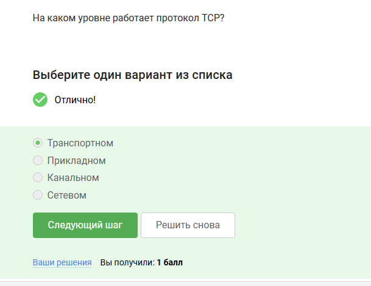{#fig:002 width=70%}

Корректные адреса должны быть в пределе 1-255(рис. [-@fig:003]).

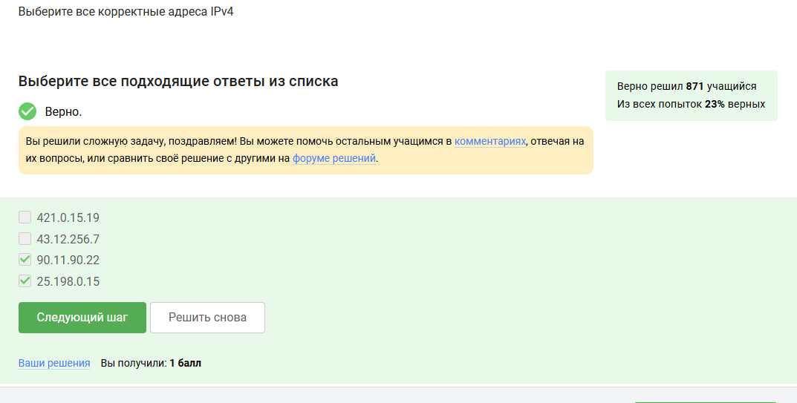{#fig:003 width=70%}

Система доменных имен  необходима для сопоставление  IP - и доменных имен(рис. [-@fig:004]).

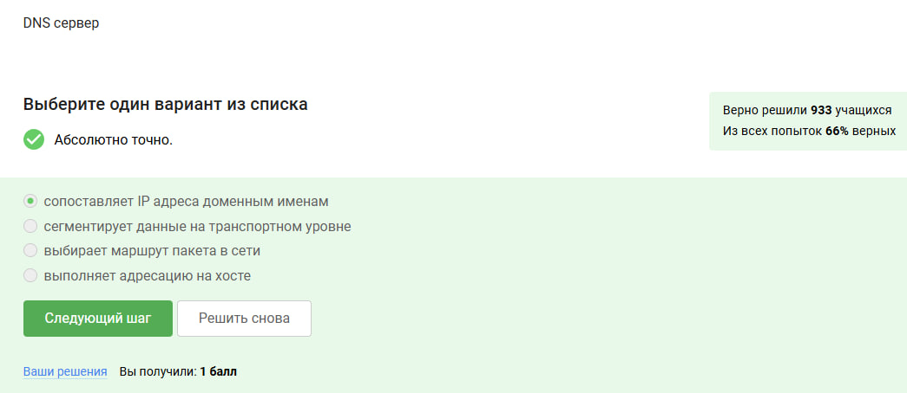{#fig:004 width=70%}

OSI система:

Физический - канальный - сетевой - транспортный - представительский - прикладной

(рис. [-@fig:005]).

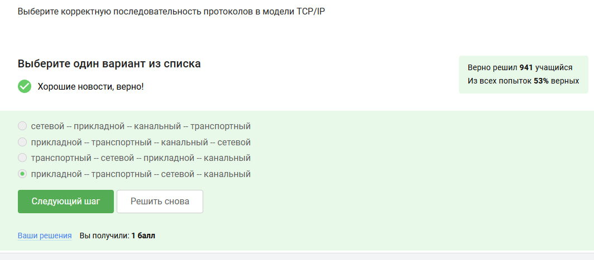{#fig:005 width=70%}

Данный протокол имеет ровно две фазы, описанные ниже( рис. [-@fig:006]).

{#fig:006 width=70%}

Протокол http передает данные открыто, а https в зашифрованном виде(рис. [-@fig:007]).

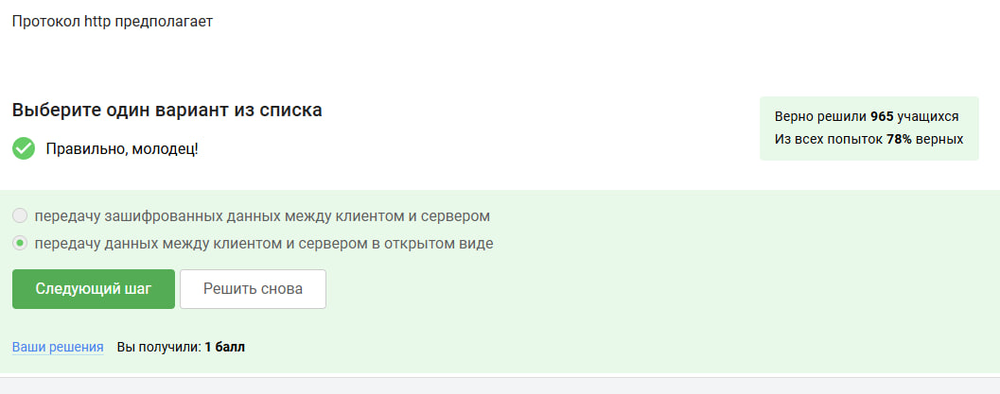{#fig:007 width=70%}

Верия протокола определяется и сервером, и клиентом при соединении(рис. [-@fig:008]).

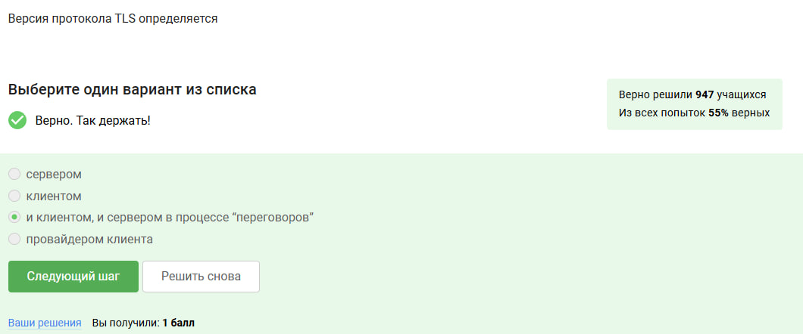{#fig:008 width=70%}

TLS(рис. [-@fig:009]).

{#fig:009 width=70%}

Куки всегда генерируется сервером, клиент к этому не имеет никакого отношения (рис. [-@fig:010]).

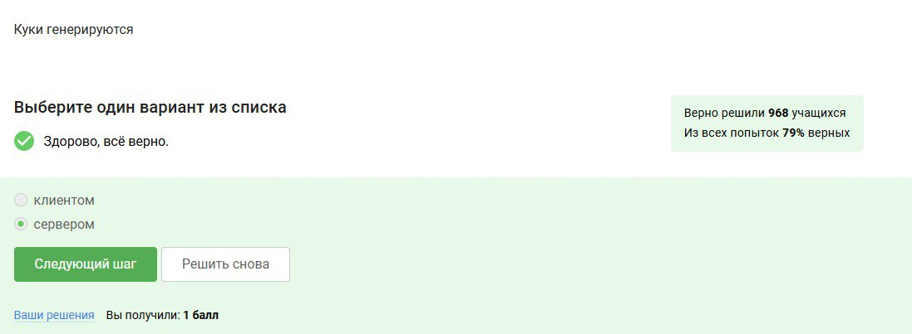{#fig:010 width=70%}

Они никак не связаны с соеднинением и используются для работы с информацией, данными(рис. [-@fig:011]).

{#fig:011 width=70%}

Куки хранят информацию о пользователе, сессии(рис. [-@fig:012]).

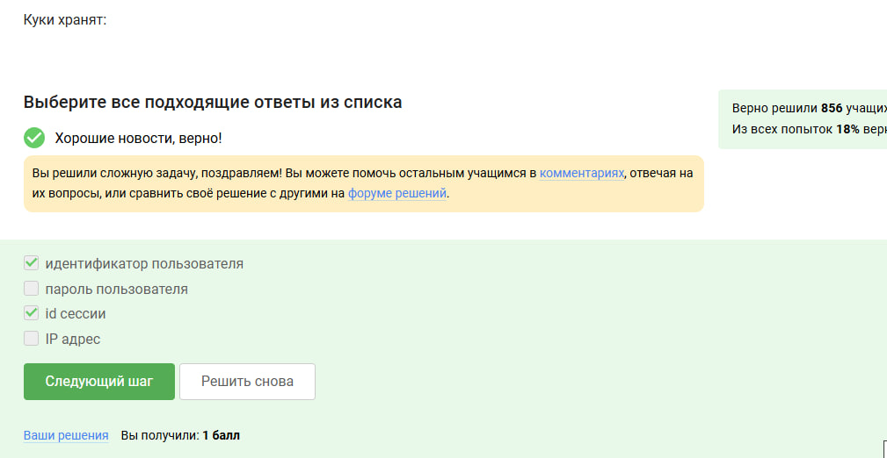{#fig:012 width=70%}

Куки(сессионные) хранятся только в течение одной сессии((рис. [-@fig:013]).

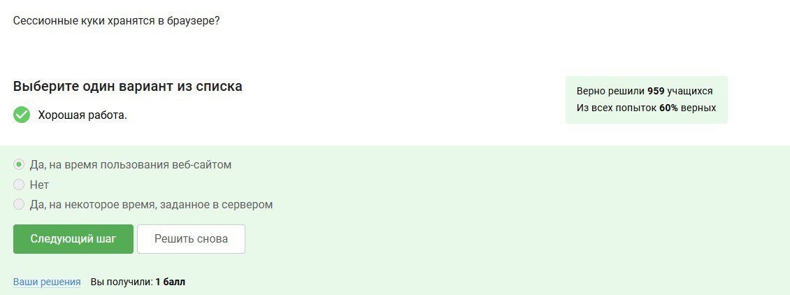{#fig:013 width=70%}

TOR имеет 3 промежуточных узла(рис. [-@fig:014]).

рис. [-@fig:014]).

{#fig:014 width=70%}

IP - адрес известен и отправителю, и получателю(рис. [-@fig:015]).

{#fig:015 width=70%}

Секретный ключ формируется со всеми уччастниками обмена(рис. [-@fig:016]).

{#fig:016 width=70%}

Ответ на скриншоте(рис. [-@fig:017]).

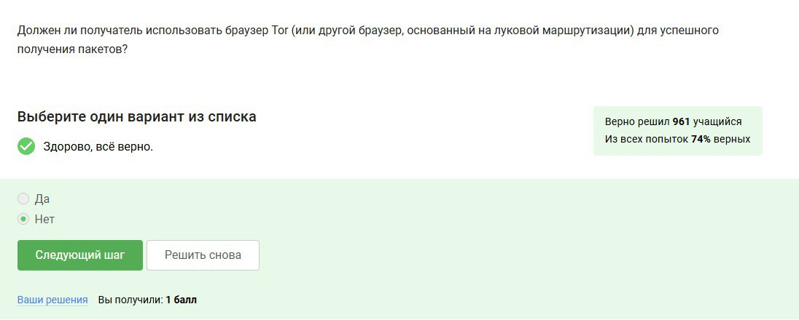{#fig:017 width=70%}

Максимально точное определение технологии - 2(рис. [-@fig:018]).

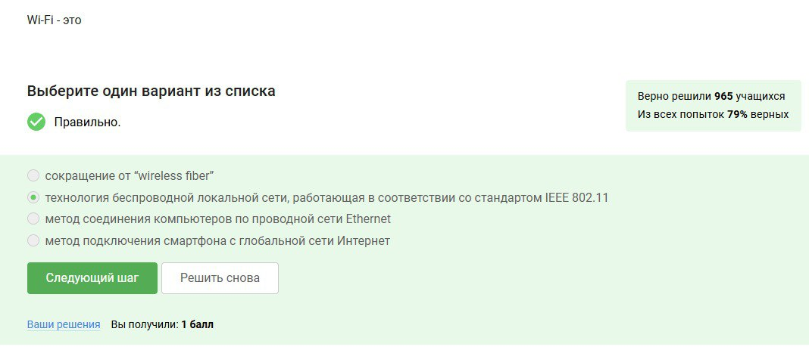{#fig:018 width=70%}

Wi-fi  принадлежит 2 уровню системы - канальному(рис. [-@fig:019]).

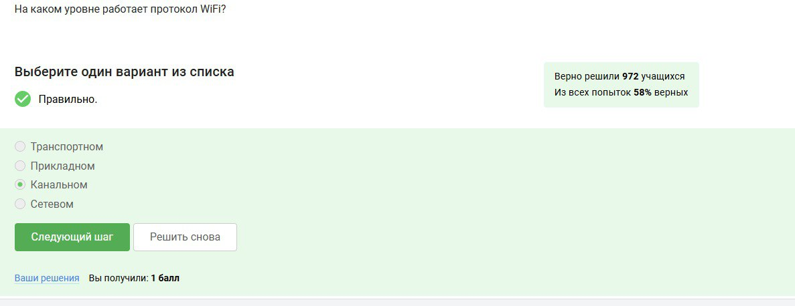{#fig:019 width=70%}

WEP  не обеспечивает безопасность аутентификации (рис. [-@fig:020]).

{#fig:020 width=70%}

Personal - для домашней сети, enterprise - нет(рис. [-@fig:021]).

{#fig:021 width=70%}

Загрузочный сектор подлежит шифрованию(рис. [-@fig:022]).

{#fig:022 width=70%}

И это можно осуществить с помощью симметричного шифрования(рис. [-@fig:023]).

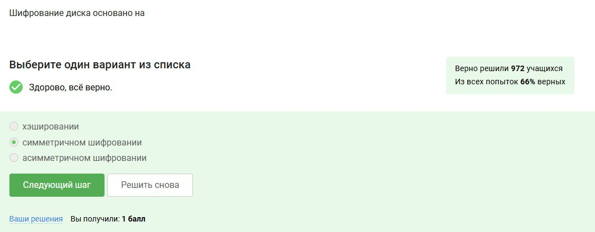{#fig:023 width=70%}

Возможные программы представлены ниже(рис. [-@fig:024]).

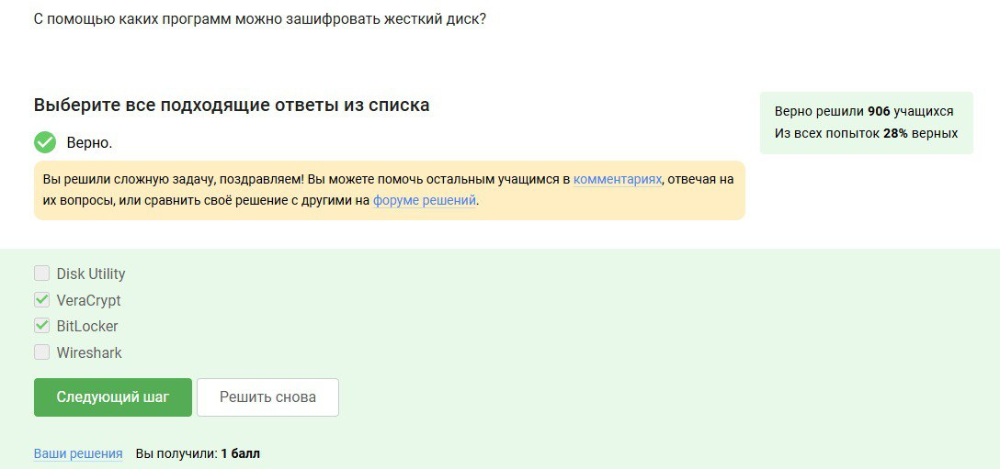{#fig:024 width=70%}

Менеджер паролей - самое надежное место для хранения паролей(рис. [-@fig:025]).

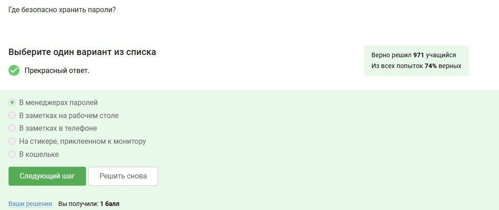{#fig:025 width=70%}

Капча - проверка и защита от ботов и нежелательных вторжений(рис. [-@fig:026]).

{#fig:026 width=70%}

Соль в данном случае непоможет(рис. [-@fig:027]).

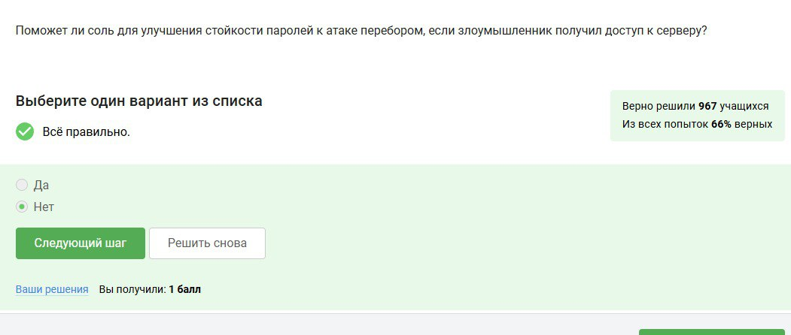{#fig:027 width=70%}

Все предложенные меры эыыеективны в боррьбе с утечками данных(рис. [-@fig:028]).

{#fig:028 width=70%}

Хэширование - технология скрытия данных для дальнейшего хранения в зашифрованном виде(рис. [-@fig:029]).

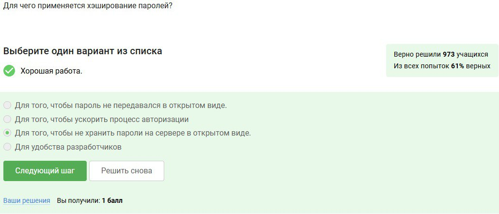{#fig:029 width=70%}

Наименее читабельные, лишенные смысла и длинные пароли являются самыми надежными(рис. [-@fig:030]).

{#fig:030 width=70%}

К сожалению, фишинговые сообщения могут придти даже со знакомых адресов(рис. [-@fig:031]).

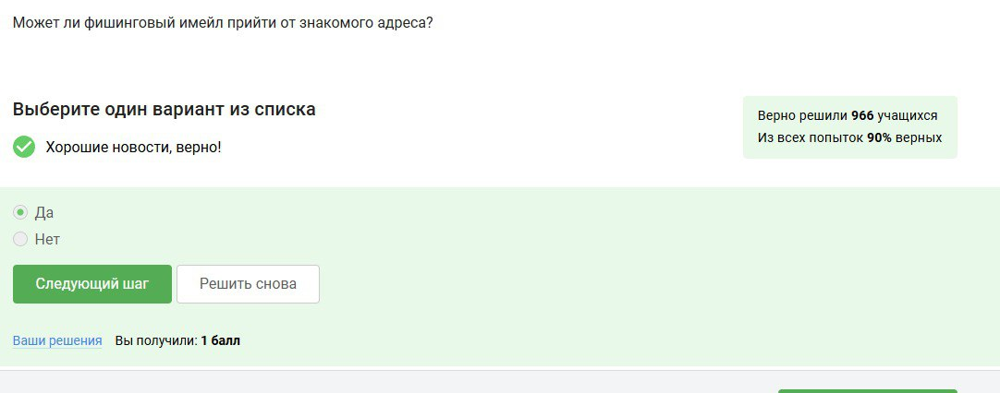{#fig:031 width=70%}

Ответ на скриншоте(рис. [-@fig:032]).

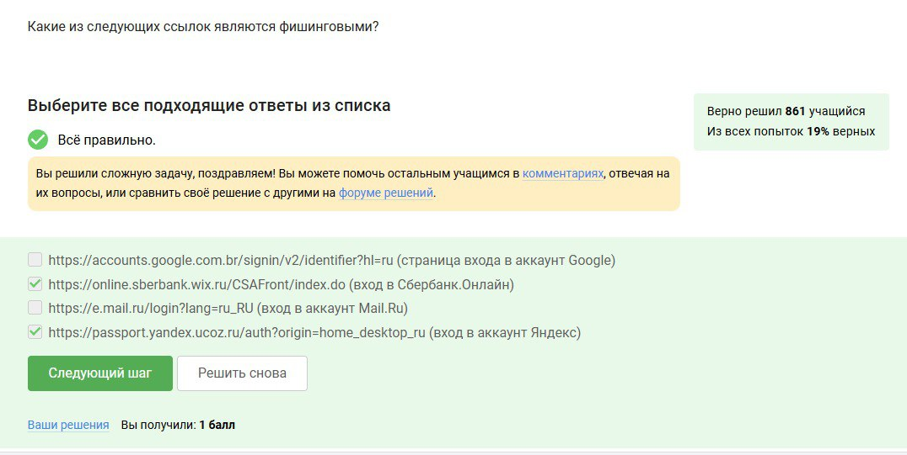{#fig:032 width=70%}

Спуффинг атаки - это атаки подмена настоящих имен на похожие(рис. [-@fig:033]).

{#fig:033 width=70%}

Ответ на скриншоте(рис. [-@fig:034]).

{#fig:034 width=70%}

Ключ формируется при генерации самого первого сообщения(рис. [-@fig:035]).

{#fig:035 width=70%}

Cквозное шифрование обеспечивает целостность данных путем передачи по узлам связи(рис. [-@fig:036]).

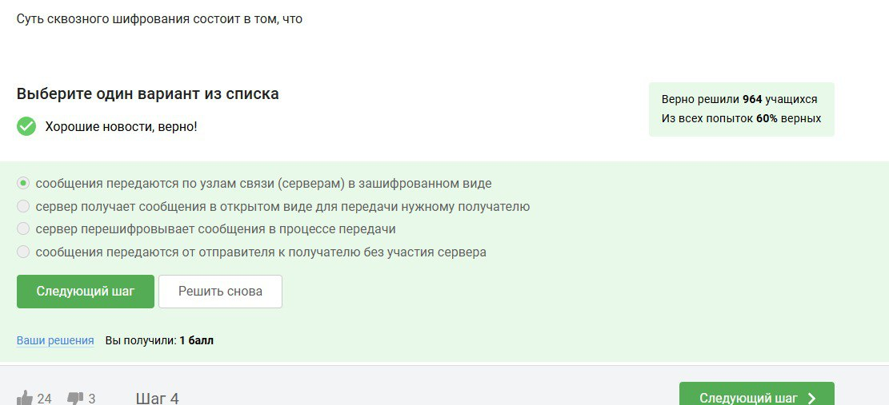{#fig:036 width=70%}

Ассимитричное шифрование предполагает разные наборы ключей у сторон(рис. [-@fig:037]).

{#fig:037 width=70%}

Отличительные черты хэш-функций представлены ниже(рис. [-@fig:038]).

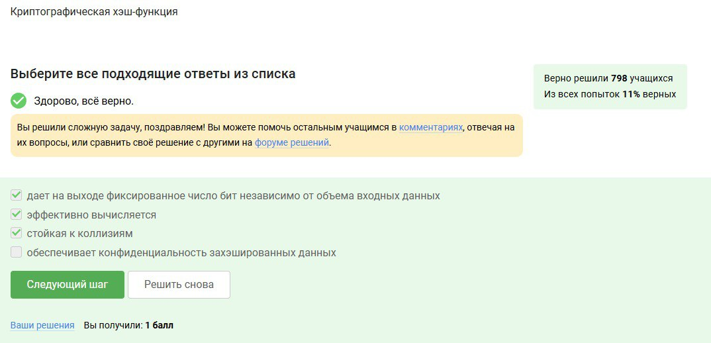{#fig:038 width=70%}

Основной алгоритм ЦП - RSA, однако существует и ГОСТ и другие(рис. [-@fig:039]).

{#fig:039 width=70%}

Верное определение указано на скриншоте (рис. [-@fig:040]).

{#fig:040 width=70%}

Цифровая подптсь осуществляется посредством хэширования и открытых ключей(рис. [-@fig:041]).

{#fig:041 width=70%}

ЦП требует наличие самой подписи, открытого ключа и сообщения - без этого технология невозможна(рис. [-@fig:042]).

{#fig:042 width=70%}

Цифровая подпись также не обеспечивает конфиденциальность данных, она гарантирует только их целостность(рис. [-@fig:043]).

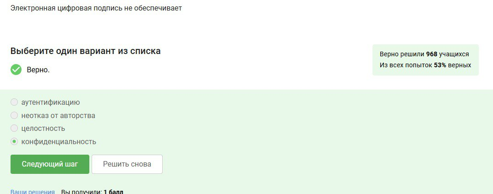{#fig:043 width=70%}

В данном случае данные особо важны, поэтому используется усиленный тип (рис. [-@fig:044]).

{#fig:044 width=70%}

Ответ на скриншоте(рис. [-@fig:045]).

{#fig:045 width=70%}

Все платежные системы отмечены на скриншоте (рис. [-@fig:046]).

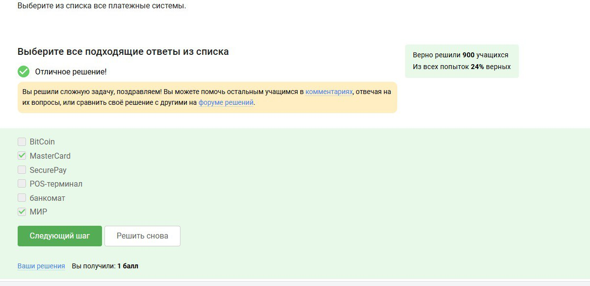{#fig:046 width=70%}

Для того, чтобы выполнялся фактор многофакторности, необходимо наличие хотя бы двух атрибутов разных типов проверки - пароль и код, код и отпечаток пальца (рис. [-@fig:047]).

{#fig:047 width=70%}

Для усиления безопасности при платежах используется многофакторная система(рис. [-@fig:048]).

{#fig:048 width=70%}

Важное преимущество хэш-функций это практически невозможность восстановить данные по ее результату (рис. [-@fig:049]).

{#fig:049 width=70%}

Он обладает всеми перечисленными свойствами(рис. [-@fig:050]).

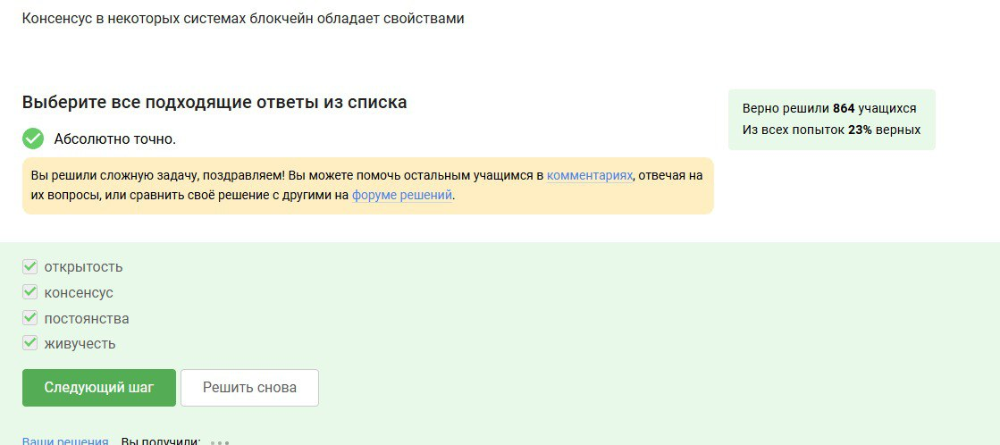{#fig:050 width=70%}

Участники хранят ключи цифровой подписи(рис. [-@fig:051]).

{#fig:051 width=70%}

Ответ на скриншоте(рис. [-@fig:052]).

{#fig:052 width=70%}

Данные с роутера всегда передаются в зашифрованном виде, но после аутентификации(рис. [-@fig:053]).

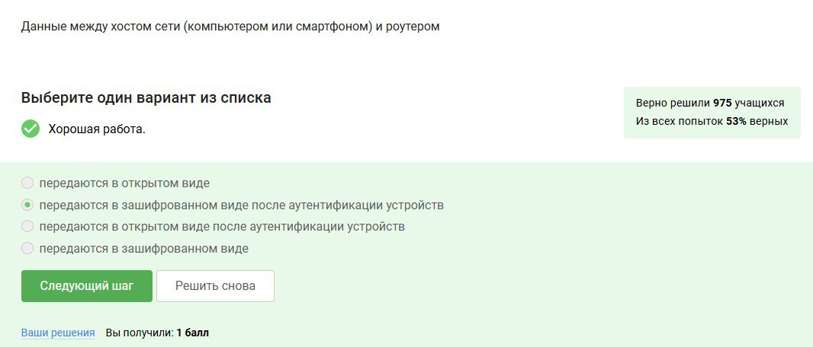{#fig:053 width=70%}

Завершение курса

К сожалению, в процессе выполнения курса пришлось столкнуться с проблемой невозможности получения сертификата, тем не менее пройдено 92% материала и выполнены все задания.

(рис. [-@fig:54]).

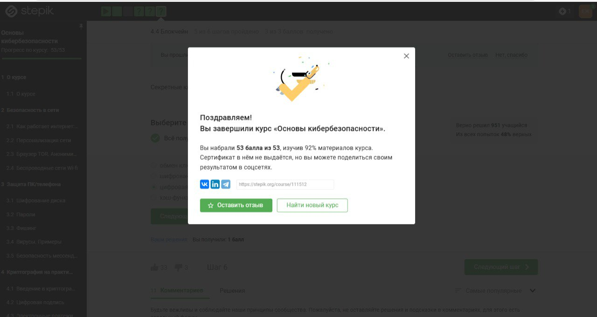{#fig:54 width=70%}

# Выводы

В отчете представлено прохождение курса "Основы кибербезопасности" на платформе Stepik. В ходе работы былы получены знания по организации безопасности, шифрованию данных, вирусах и не только.

